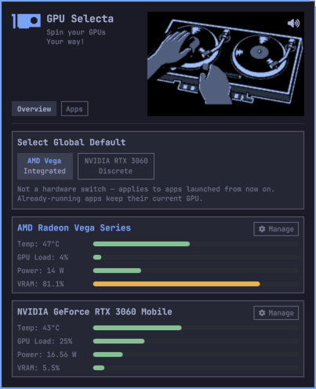
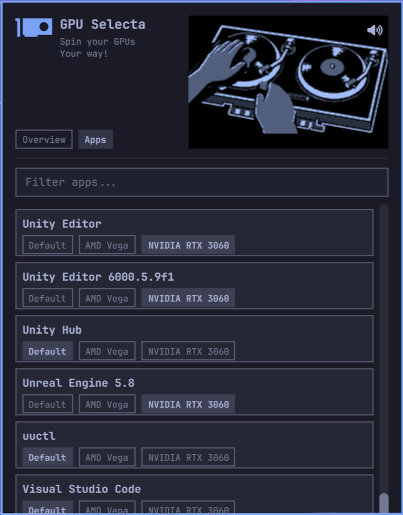

# GPU Selecta : A multiple GPU control system for Omarchy * with vinyl scratch vibes *

GPU Selecta is an [Omarchy](https://omarchy.org/) plugin dashboard for Linux systems
with multiple GPUs. You can set your default GPU from those in your system.  You can specify which GPU will be used by any App: so if you have graphics heavy games or 3d software like Blender or Unreal Engine, you can assign that to run on your most powerful GPU and let everything else run on the low powered integrated system.  Do it your way!
Keep you system cool, and let it rip when it needs too while you enoy the vinyl vibes.

<p align="top">
  
  
</p>

<p align="center"><em>Global GPU selection and telemetry · Per-application GPU routing</em></p>

Renderer switching uses stable PCI addresses with Mesa's `DRI_PRIME` support
for AMD, Intel, and Nouveau GPUs. Proprietary NVIDIA GPUs use NVIDIA PRIME
render offload. Other detected GPUs still appear in the dashboard, but GPU
Selecta will not offer routing controls when the installed driver cannot
select them safely.

## What this is (and isn't)

GPU Selecta is a renderer selector and monitoring dashboard, not a hardware
GPU mux. On a muxless hybrid laptop, the integrated GPU continues to drive
the display. The routing features choose which GPU newly launched *apps*
render on:

- **Global toggle**: sets PRIME offload environment variables for the whole
  session, applied live via Omarchy's Hyprland toggle mechanism — no restart
  or logout needed, but it only affects apps launched *after* you flip it.
- **Per-app pinning**: rewrites a specific app's `.desktop` launcher entry
  (the standard XDG override mechanism — this is the same technique GNOME's
  own "Launch using Discrete Graphics Card" uses) so that app always renders
  on the GPU you choose, regardless of the global toggle. The full list of
  installed apps is scanned automatically — nothing is pre-pinned; every app
  starts at "Default" (follow the global toggle) until you change it.

Per-app pinning is the more power-efficient option for apps you use
regularly: the discrete GPU only wakes while that specific app is open,
rather than for an entire session (or, worse, for literally everything if
the global toggle is left on).

Neither routing mechanism can affect a process that's already running — env
vars only apply at process launch.

## Install

```sh
omarchy plugin add https://github.com/Rufussed/gpu-selecta.git --enable
```

If the widget doesn't appear, restart the shell once:

```sh
omarchy restart shell
```

### From a local checkout (development)

```sh
ln -s "$PWD" ~/.config/omarchy/plugins/rufussed.gpu-switch
omarchy-shell shell rescanPlugins
```

QuickShell's file watcher doesn't follow symlinks, so after edits run
`omarchy restart shell`.

## Remove

```sh
omarchy plugin remove rufussed.gpu-switch
```

This unregisters the widget and removes its checkout. It does **not**
automatically revert any per-app `.desktop` overrides or the global toggle
file — reset each pinned app back to `Default` and turn the global toggle
back to `Integrated` from the panel *before* removing the plugin, so nothing
is left pinned to a GPU with no way to change it back. (If you forget:
delete `~/.local/state/omarchy/toggles/hypr/gpu-switch-render-default.lua`
for the global toggle, and any `~/.local/share/applications/<app>.desktop`
file that starts with `# Written by the GPU Switch plugin` for per-app
overrides, plus `~/.config/omarchy/gpu-switch/wrappers/` — originals are
preserved in `~/.config/omarchy/gpu-switch/backups/` if you want to restore
them by hand.)

## Dependencies

`python3`, `hyprctl`, `lspci` — all already present on a standard Omarchy
install. `nvidia-smi` is used opportunistically for NVIDIA telemetry/
persistence-mode when present. No other external packages or services.

## Use

- **Click** the bar icon to open the panel.
- **Overview tab**: the **Global Default** toggle (`Integrated` / `Discrete`,
  labeled with whatever vendor is actually detected — e.g. "Integrated
  (AMD)" / "Discrete (NVIDIA)") plus a live card per GPU showing
  temperature, busy %, power draw, and a VRAM usage bar.
  - Each GPU card has a **Manage** button (top right) that reveals basic
    Power Governor (`Auto`/`High`/`Low`/`Peak`) and Fan (`Auto`/`35%`/`60%`/
    `80%`/`100%`) controls, when the hardware actually exposes them over
    sysfs — an honest "not supported" note otherwise (e.g. NVIDIA laptop
    GPUs never expose fan control on Linux; many integrated GPUs have no fan
    node at all since the fan is EC-controlled).
- **Apps tab**: every installed app, auto-discovered and filterable, each
  with `AMD` / `Default` / `NVIDIA` pills. `Default` means "follow the
  Overview tab's global toggle."

## How it works

**Global toggle** writes a small file to
`~/.local/state/omarchy/toggles/hypr/gpu-switch-render-default.lua` using
Omarchy's own Hyprland toggle-file convention — `hl.env()` calls there are
re-applied on every `hyprctl reload`, which is what makes this take effect
live.

**Per-app pinning** writes an override to `~/.local/share/applications/<app>.desktop`
where every `Exec=` line points at a small generated wrapper script in
`~/.config/omarchy/gpu-switch/wrappers/` that exports (or unsets) the PRIME
offload env vars and then `exec`s the real binary, e.g.:

```sh
#!/bin/sh
export __NV_PRIME_RENDER_OFFLOAD=1
export __GLX_VENDOR_LIBRARY_NAME=nvidia
export __VK_LAYER_NV_optimus=NVIDIA_only
exec /usr/bin/chromium "$@"
```

A wrapper is used instead of prefixing `Exec=` directly with `env VAR=val ...`
because some launchers only look at the *first* whitespace-delimited token of
`Exec=` to find the real executable (Omarchy's own browser-open shortcut does
this) — with an `env ...` prefix that token is literally `env`, which such a
launcher then runs with no command instead of the app. Routing through a
wrapper keeps that first token a real, directly-executable path, so both
naive and fully spec-compliant launchers work. Any `%f`/`%F`/`%u`/`%U` field
code stays in the visible `Exec=` line, after the wrapper path, so
argument/URL substitution still works normally. `TryExec=` is left untouched,
since the desktop entry spec requires it to stay a bare executable path. The
original file is snapshotted to `~/.config/omarchy/gpu-switch/backups/` the
first time an app is touched, so resetting an app to `Default` restores it
exactly (or removes the override entirely, revealing the system default, if
one exists) and removes that app's wrapper scripts.

This only affects apps launched through a `.desktop` entry — the app grid,
Omarchy's menu, launchers like Walker/fuzzel. It doesn't affect a binary run
directly from a terminal.

**Power governor / fan control** write directly to the same amdgpu sysfs
nodes tools like LACT use (`power_dpm_force_performance_level`,
`hwmon/pwm1`), falling back to `pkexec` if your user doesn't already have
write permission there. NVIDIA fan control isn't offered — Linux has no
supported path for it on laptop GPUs, on any driver.

## Config

Per-app state lives in `~/.config/omarchy/gpu-switch/apps.json` if you'd
rather edit it directly:

```json
{
  "blender": { "label": "Blender", "gpu": "nvidia", "desktopFiles": ["blender.desktop"] }
}
```

Any app not listed here defaults to `"auto"` (follow the global toggle) —
this file only needs entries for apps you've actually pinned.

The learned fallback power maximum lives in
`~/.local/state/omarchy/gpu-selecta/telemetry-extrema.json`. Delete that file
to reset it. Temperature uses the GPU's reported critical temperature when
available and a 100°C fallback otherwise.

## Security

GPU/app telemetry is 100% unprivileged reads (sysfs, `.desktop` files).
Render routing (global toggle, per-app pinning) only ever writes to files
already owned by your user account (`~/.config`, `~/.local/share/applications`,
`~/.local/state`) — no root or `pkexec` needed for those. Power governor and
fan control *do* write to sysfs and may prompt for `pkexec` authentication
if your udev rules don't already grant write access there, same as any
other GPU tuning tool.

## Credits

GPU vendor/driver detection and the power governor/fan sysfs handling
follow the same approach as [OmaGPU](https://github.com/ucmz851/omagpu) by
ucmz851 (MIT licensed) — LACT-inspired reads of `power_dpm_force_performance_level`
and `hwmon`. OmaGPU remains the more complete tuning/telemetry dashboard if
that's all you need; this plugin's focus is GPU *launch routing*, with basic
tuning included for convenience on hybrid systems.

## License

MIT
